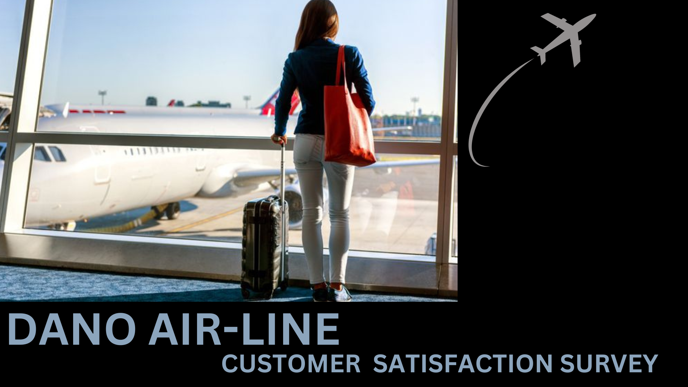
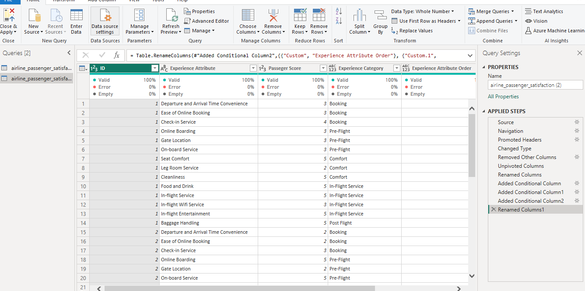
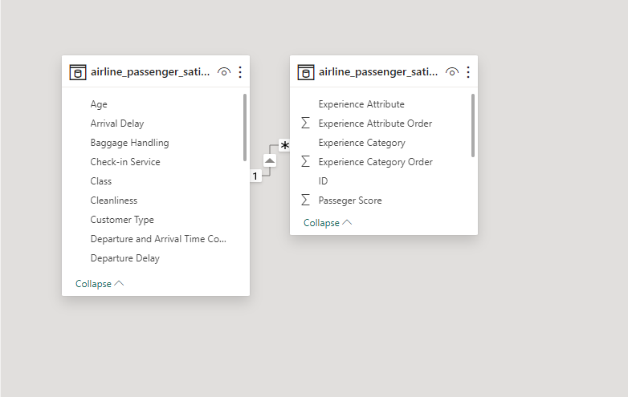
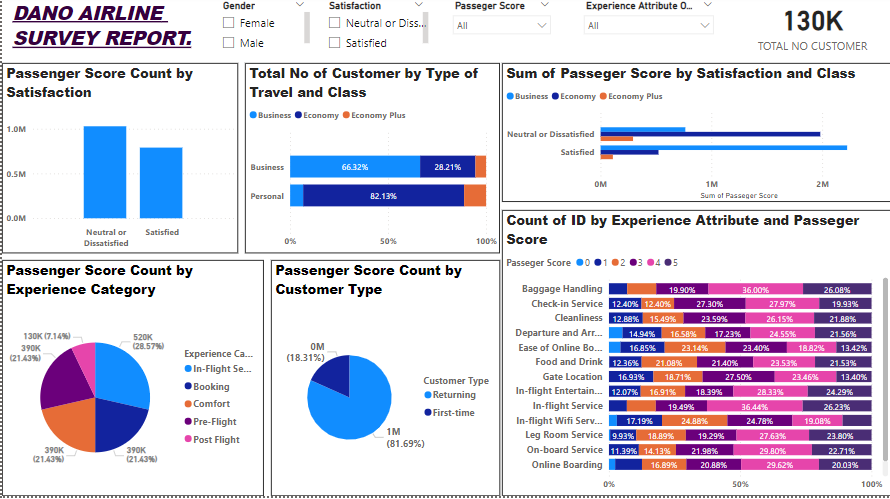

# Airline_Customer -Satisfactory_Survey

## Introduction
This is a fictional Data set for Dano airline, customer satisfaction scores from 120,000+ airline passengers, including additional information about each passenger, their flight, and type of travel, as well as their evaluation of different factors like cleanliness, comfort, service, and overall experience.

## Problem Statement
The most recent findings from the passenger survey have been received, indicating a satisfaction rate that has dropped below 50% for the first time. Recognizing the urgency, the leadership team has enlisted your expertise to swiftly analyze the data and identify critical areas that require attention to restore positive momentum.

## Data Sourcing
 [here] (https://docs.google.com/spreadsheets/d/15Kp-2yfQFNRGJPNOkpMwG-OMX8xVZOJ5VL7f35v7sRQ/edit)

 ## Data Transformation
This dataset consists of a single table with 24 fields. To enhance clarity, the data has been organized into fact and dimensional tables. A new table was created by duplicating the existing one, which is made up of the fact table alone using the customer ID as the primary.
  The fact table encompasses various aspects such as Departure and Arrival Time Convenience, Ease of Online Booking, Check-in Service, Online Boarding, Gate Location, On-board Service, Seat Comfort, Legroom Service, Cleanliness, Food and Drinks, Inflight Service, Inflight Wi-Fi Service, Inflight Entertainment, and Baggage Handling. These attributes were unpivoted and labeled as "experience attributes" in a separate column. Passengers then assigned scores (1 to 5) based on their satisfaction, resulting in the creation of the "Passenger Score" column.
To facilitate analysis, the experience attributes were further categorized into five "Experience Categories" – Booking, Pre-flight Service, Comfort, Inflight Service, and Post Flight. Additional conditional columns were introduced to indicate the experience category of each customer.

The remaining fields in the dataset form the dimensional table, providing detailed customer information. This approach streamlines the data, making it more comprehensible and facilitating the generation of insightful reports

## Data Modelling
This is the automated model,the two tables connected because there was already aprimary key-Snow flake schema.

## Visualization and Analysis
I utilized six canvases in my survey report, incorporating stacked bar charts, column charts and pie charts. Additionally, I implemented slicers and a card visual for enhanced interactivity. This diverse range of visualization offers a comprehensive and visually appealing presentation of the survey data. Stacked bar charts and column charts effectively illustrate comparisons and trends, while pie charts provide a clear overview of satisfaction distribution. Slicers enable users to interactively filter and explore specific segments, enhancing the reports. Together, these elements create a dynamic and user-friendly report, facilitating a deeper understanding and analysis of the survey findings. Paying attention to clear labelling, color choices and relevant annotations ensures that the visuals are easily interpretable for the audience.

INSIGHTS
Out of the total passengers surveyed, 1,028,328 expressed neutral or dissatisfied sentiments about their experience, while 789,992 reported satisfactions. Notably, a significant proportion of the satisfied passengers belonged to the business class, while the majority of those expressing neutral or dissatisfied opinions were in the economy class. 

Canva 6 illustrates the distribution of survey ratings given by passengers for each experience category. The percentages are calculated based on the passenger ID as a reference, providing insights into how different experiences are rated across the surveyed population.

Passengers have assigned the highest percentage of 28.51% scores to the Inflight Service category, indicating that this aspect of the travel experience received the most favorable ratings. Notably also, Post Flight category has received lower ratings of 7.14% from passengers, indicating that there is room for improvement in this aspect of the travel experience. Therefore, exploring specific elements within the Post Flight category and addressing any issues or concerns raised by passengers would enhance overall satisfaction.

A majority of passengers, comprising 66.32%, who categorized their travel type as business, opt for the business class. Among them, 28.21% choose economy, and 5.71% prefer economy plus. For those traveling for personal reasons, 6.65% choose economy, 82.13% prefer economy class, and 11.22% opt for economy plus.

In terms of customer loyalty, a significant 81.69% are returning customers, indicating a high rate of repeat business, while 18.31% are first-time flying customers.

## Recommendation
These visualizations effectively convey the distribution of survey scores and highlight areas for improvement, such as the lower-rated Post Flight category.
To enhance overall satisfaction, specific attention can be directed towards improving experiences for economy and economy plus passengers. Strategies may include focusing on seat comfort, in-flight entertainment, and post-flight services. 

